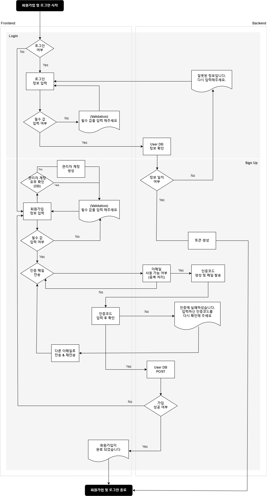
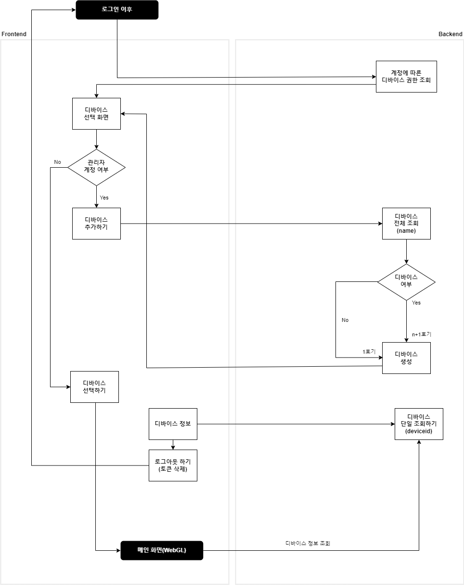
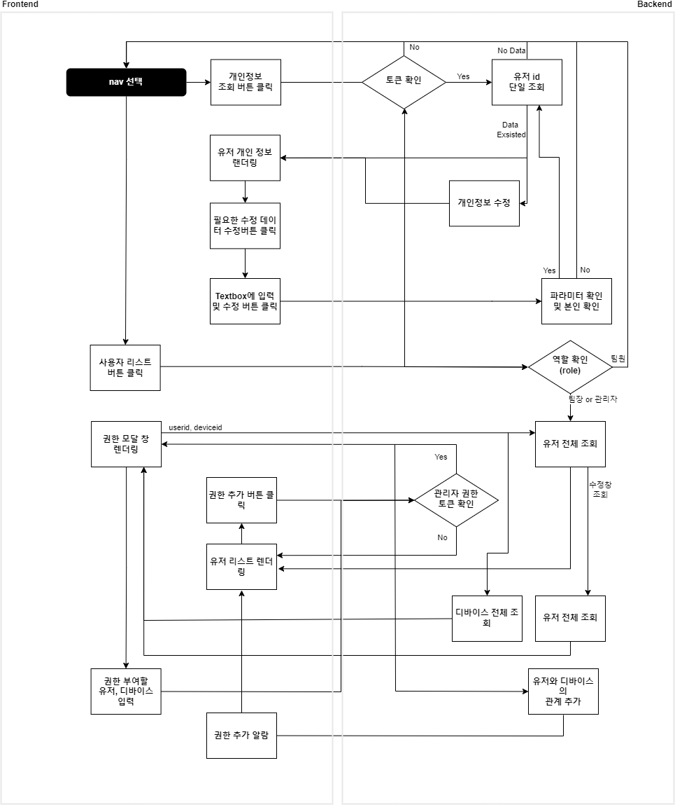
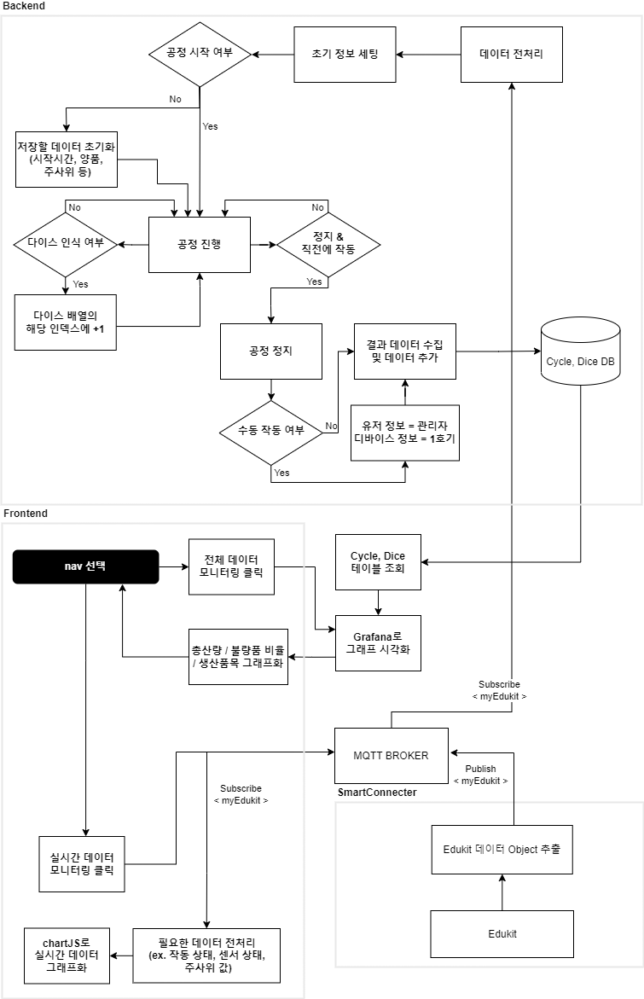
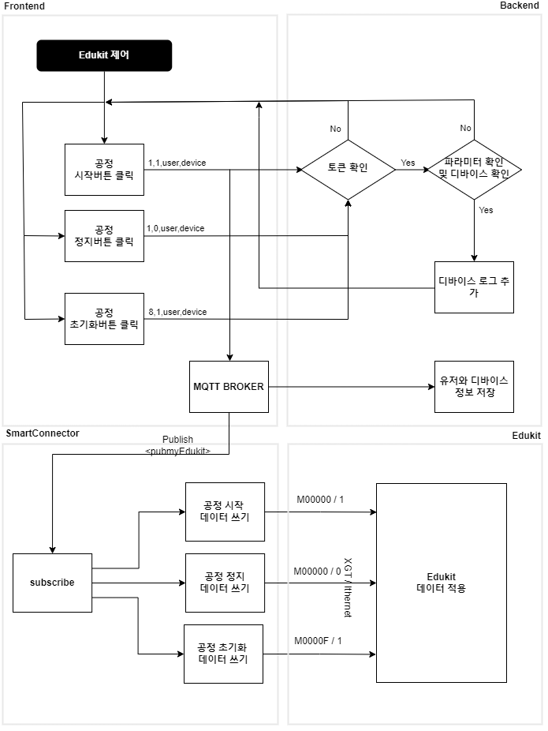
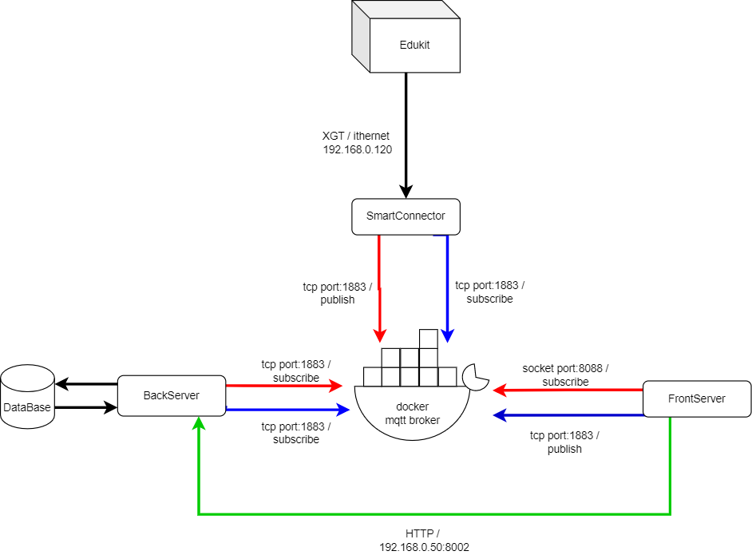

# [Final] 스마트 팩토리 프로젝트
## 기획목적
**Edukit으로 디지털 트윈 실시간 모니터링 시스템 구축**

 

## 기획 아이디어
산업 분야로 옮겨진 메타버스 및 디지털 트윈을 통해 기존의 자동화된 기기 관리를 웹 UI UX로 구현하고, 구현한 기기의 실시간 데이터 확인 및 불량품 판독을 가능하게 하여 기기 관리자로 하여금 기기제어 및 생산품 관리가 용이하도록 했습니다.

## 프로세스 구조도
- **회원가입 & 로그인**
 

- **로그인 이후**
 

- **개인정보 및 권한 부여**
 

- **디바이스 모니터링**
 

- **Edukit 데이터 플로우**
 

- **Smartfactory 플로우**
 

## 프로젝트 방법 및 과정